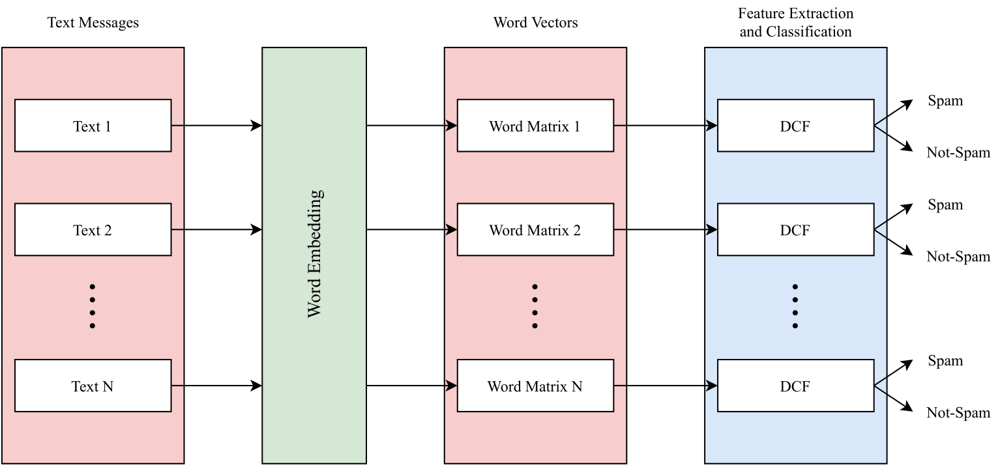

# Deep Convolutional Forest: A Dynamic Deep Ensemble Approach for Spam Detection in Text
> review the papers
> 
[](https://link.springer.com/article/10.1007/s40747-022-00741-6)
[](https://www.python.org)
[](https://www.tensorflow.org)

## Abstract
The increase in people’s use of mobile messaging services has led to the spread of social engineering attacks like phishing, considering that spam text is one of the main factors in the dissemination of phishing attacks to steal sensitive data such as credit cards and passwords. In addition, rumors and incorrect medical information regarding the COVID-19 pandemic are widely shared on social media leading to people’s fear and confusion. Thus, filtering spam content is vital to reduce risks and threats. Previous studies relied on machine learning and deep learning approaches for spam classification, but these approaches have two limitations. Machine learning models require manual feature engineering, whereas deep neural networks require a high computational cost. This paper introduces a dynamic deep ensemble model for spam detection that adjusts its complexity and extracts features automatically. The proposed model utilizes convolutional and pooling layers for feature extraction along with base classifiers such as random forests and extremely randomized trees for classifying texts into spam or legitimate ones. Moreover, the model employs ensemble learning procedures like boosting and bagging. As a result, the model achieved high precision, recall, f1-score and accuracy of 98.38%.

<br>
Figure 1: Workflow of data: text preprocessing, word embedding, feature extraction and classification



<br>
Figure 2: Structure of Deep Convolutional Forest (DCF)


<br>

# Usage
This project was prepared to run on Colab

To use the code on Colab:
1. Uncomment the following in cell #5 to download GloVe embeddings

	`!wget http://nlp.stanford.edu/data/glove.6B.zip`

	`!unzip -q glove.6B.zip`


# Updated Instructions for MacOS M3 with Python 3.11 and TensorFlow 2.16
To run the code on your local machine with the specified environment, follow these steps:

1. Ensure you have Python 3.11 and TensorFlow 2.16 installed. You can install TensorFlow with the following command:
   ```bash
   pip install tensorflow==2.16
   ```

2. Update the code to use the Functional API for building the model. Here's an example snippet:

   ```python
   from tensorflow.keras import layers, models

   def build_model(input_shape):
       inputs = layers.Input(shape=input_shape)
       x = layers.Conv1D(128, 5, activation='relu')(inputs)
       x = layers.MaxPooling1D(5)(x)
       x = layers.Conv1D(128, 5, activation='relu')(x)
       x = layers.MaxPooling1D(5)(x)
       x = layers.Conv1D(128, 5, activation='relu')(x)
       x = layers.GlobalMaxPooling1D()(x)
       x = layers.Dense(128, activation='relu')(x)
       outputs = layers.Dense(1, activation='sigmoid')(x)

       model = models.Model(inputs, outputs)
       return model
   ```

3. Replace the deprecated `pandas.append` function. Use `pd.concat` instead. For example:
   ```python
   import pandas as pd

   # Assuming df1 and df2 are your DataFrames
   df1 = pd.DataFrame({'A': [1, 2], 'B': [3, 4]})
   df2 = pd.DataFrame({'A': [5, 6], 'B': [7, 8]})

   df = pd.concat([df1, df2])
   ```

# Cite
```bibtex
@article{Shaaban2022,
    title        = {Deep convolutional forest: a dynamic deep ensemble approach for spam detection in text},
    author       = {Shaaban, Mai A. and Hassan, Yasser F. and Guirguis, Shawkat K.},
    year         = 2022,
    month        = {Apr},
    day          = 26,
    journal      = {Complex {\&} Intelligent Systems},
    doi          = {10.1007/s40747-022-00741-6},
    issn         = {2198-6053},
    url          = {https://doi.org/10.1007/s40747-022-00741-6},
    abstract     = {The increase in people's use of mobile messaging services has led to the spread of social engineering attacks like phishing, considering that spam text is one of the main factors in the dissemination of phishing attacks to steal sensitive data such as credit cards and passwords. In addition, rumors and incorrect medical information regarding the COVID-19 pandemic are widely shared on social media leading to people's fear and confusion. Thus, filtering spam content is vital to reduce risks and threats. Previous studies relied on machine learning and deep learning approaches for spam classification, but these approaches have two limitations. Machine learning models require manual feature engineering, whereas deep neural networks require a high computational cost. This paper introduces a dynamic deep ensemble model for spam detection that adjusts its complexity and extracts features automatically. The proposed model utilizes convolutional and pooling layers for feature extraction along with base classifiers such as random forests and extremely randomized trees for classifying texts into spam or legitimate ones. Moreover, the model employs ensemble learning procedures like boosting and bagging. As a result, the model achieved high precision, recall, f1-score and accuracy of 98.38%.}
}
```

Feel free to follow these updated instructions for running the project with the latest tools and methodologies.